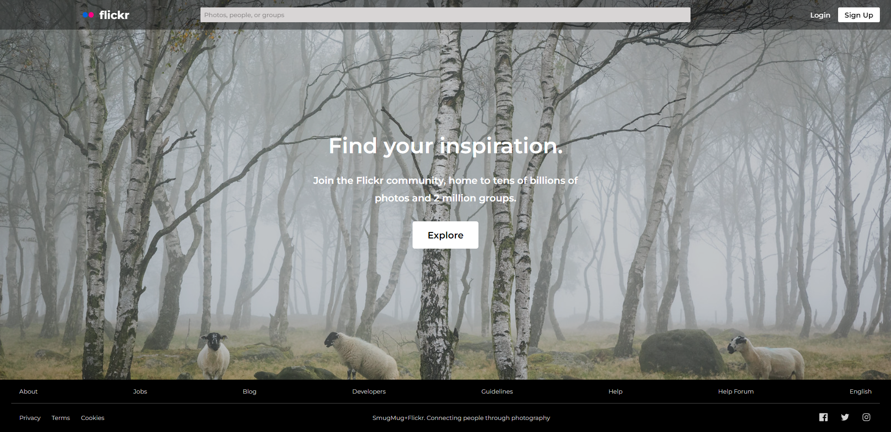

# Flickr
### A recreation of the Flickr.com home and explore pages, not 100% identical, but the general layout is there.

## [Live Link](https:://kiran-flickr.surge.sh)

## Used
- React
- Redux w/Saga
- Redux Toolkit
- CSS Modules
- Flickr API

## Todo
- [❌] Fully Mobile Responsive 
- [❌] Add search, maybe trending? 

### Home Page
- The home page design is based off the mobile/tablet, at least for the footer

### Explore Page
- Had to block out a dick pic since the family option on the request url doesn't make a difference. Possibly because the user's who upload nsfw don't actually tag it as nsfw 

